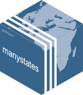

# manystates 

<!-- badges: start -->
[](https://www.tidyverse.org/lifecycle/#stable)


[](https://app.codecov.io/gh/globalgov/manystates?branch=main)
[](https://www.codefactor.io/repository/github/globalgov/manystates)
<!-- badges: end -->

`manystates` is a package within the [many universe of packages](https://github.com/globalgov)
useful for working with states and state-like entities.
It contains an ensemble of datasets on states and 
state-like entities in the world,
including information on states' beginning and, where applicable, end dates,
and geographical and other characteristics. 
Please also check out [`{manydata}`](https://github.com/globalgov/manydata) for
more information about the other packages and tools to handle data from the
many universe of packages. 

In addition, the package includes several unique functions to help you work with
state data, including `code_states()` to identify states within texts,
and `generate_states()` to create fictional state names.
The package is geared towards global governance research, 
but can also be used by anyone interested in state actors across time. 

## How to install

It is easy to install and start analysing global governance data in R. 
Simply install the core package,
[manydata](https://github.com/globalgov/manydata), as follows,
and then you can discover, install and update various 'many packages' from the
console.

```{r install, eval= FALSE}
manydata::call_packages() # this prints a list of the publicly available data packages currently available
# manydata::call_packages("manystates") # this downloads and installs the named package
```

## Included data

Once you have installed the package, you can access the primary datacube in the
package, `states`, as follows.
You can see that currently the datacube combines three datasets:
Gleditsch and Ward's (1999) state list,
the International System(s) Dataset (ISD) by Griffiths and Butcher (2013),
and the GGO state list developed by the PANARCHIC team for this package.

```{r datasets, eval = TRUE}
manydata::describe_datacube(manystates::states)
manystates::states
```

Working with ensembles of related data has many advantages for robust analysis.
Take a look at our vignettes [here](https://globalgov.github.io/manydata/articles/user.html).

## Included functions

In addition to the datasets, the package also includes two main
functions that help you work with state data.

### code_states()

`code_states()` is useful for identifying states or state-like entities 
within text data.
This is a non-trivial task, as state names can vary widely in their
spelling, abbreviation, and context,
and there are many potential ambiguities (e.g., "Korea" could refer to
North or South Korea).
The function uses a comprehensive library of contemporary and historical 
state names and their variants to identify states in a given text.
It returns a data frame with the identified states and their
corresponding ISO 3166 alpha-3 codes or standardised names.

It can handle both single strings and vectors of strings.
By default it will identify the first state mentioned in each text,
but it is possible to search for multiple states by setting the
`max_count` argument to a value greater than 1.

```{r codestates, eval = TRUE}
manystates::code_states(c("The event took place in the United Kingdom.", 
            "Switzerland and New Zealand agreed that...",
            "One of the oldest princely states is Chamba."),
            max_count = 2)
```

The function can currently discern `r nrow(manystates::code_states())` different states or state-like entities.
This is likely to increase in future releases,
but is already `r round(nrow(manystates::code_states())/230, 1)` times more than the next best package, `{states}`, for instance.

### generate_states()

Additionally, there is a seemingly whimsical function that generates
a number of random state names.
This function is inspired by observed state names,
but is not intended to reflect any actual states.
It is primarily designed for use in class exercises when a number of novel
state names are required.
It can also be used to generate fictional state names for
creative writing or games.

```{r genstates, eval = TRUE}
manystates::generate_states(3)
```

It is based on a Markov model of syllable patterns found in real state names.
Your mileage with the results of this function may vary,
but it should get more realistic as we add more state names to the underlying library,
and in the meantime it might even be instructive for classroom exercises.

Feedback on either of these functions is most welcome.

## Many packages

The development of [many packages](https://github.com/globalgov/manydata) is aimed
at collecting, connecting and correcting network data across issue-domains of
global governance.


```{r cites}
citation("manystates")
```

## Funding details

Development on this package has been funded by the Swiss National Science Foundation (SNSF)
[Grant Number 188976](https://data.snf.ch/grants/grant/188976): 
"Power and Networks and the Rate of Change in Institutional Complexes" (PANARCHIC).

James Hollway wishes to thank all the team that have contributed to this package, 
including:
Bernard Bieri, Loic Modoux, Henrique Sposito, and Jael Tan.

## Citations

While some 'many packages' can and do include novel data,
much of what they offer involves standing on the shoulders of giants.
'many packages' endeavour to be as transparent as possible about where data
comes from, how it has been coded and/or relabelled, and who has done the work.
As such, we make it easy to cite the datasets you use
by listing the official references using the function above,
as well as the package providers for their work assembling the data
by using the function below.

```{r cites2}
states <- manystates::states
manydata::call_citations(states, output = "console")
```

For the [Gleditsch and Ward (GW) dataset](http://ksgleditsch.com/statelist.html):

Gleditsch, Kristian S., and Michael D. Ward. 1999. “[A revised list of independent states since the congress of Vienna](https://doi.org/10.1080/03050629908434958).” _International Interactions_ 25: 393-413.

For the [International System(s) Dataset (ISD)](https://www.ryan-griffiths.com/data):

Butcher, Charles R., and Ryan D. Griffiths. 2020. "[States and their international relations since 1816: introducing version 2 of the International System(s) Dataset (ISD)](https://doi.org/10.1080/03050629.2020.1707199)". _International Interactions_, 46(2), 291–308.

## Contributing

If you have already developed a dataset salient to this package,
please reach out by flagging this as an [issue](https://github.com/globalgov/manystates/issues)
for us, or by forking, further developing the package yourself, and opening a
[pull request](https://github.com/globalgov/manystates/pulls)
so that your data can be used easily.

If you have collected or developed other data that may not be best for this
package, but could be useful within the wider universe of `many packages`, 
[`{manypkgs}`](https://github.com/globalgov/manypkgs) includes a number of
functions that make it easy to create a new `many package` and populate it with
clean, consistent global governance data.

If you have any other ideas about how this package or the manydata 
universe more broadly might better facilitate your empirical analysis, we'd be
very happy to hear from you.
