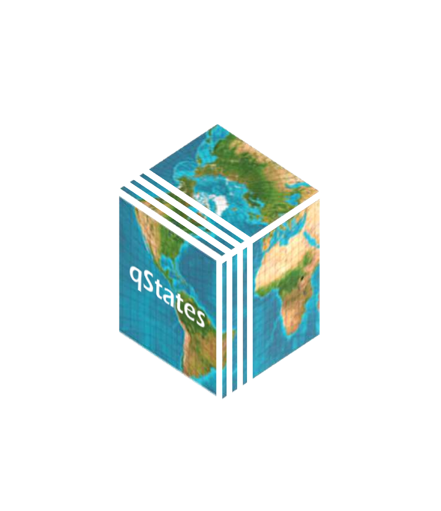

# qStates 

<!-- badges: start -->
[](https://www.tidyverse.org/lifecycle/#experimental)


<!-- [](http://hits.dwyl.com/globalgov/qStates) -->
[](https://codecov.io/gh/globalgov/qStates?branch=main)
<!--  -->
<!-- badges: end -->

`{qStates}` is a a data package for the `{qData}` ecosystem of packages. It is a data package about states actors across the globe. It encompasses several datasets with states' names and dates of beginning and ending (for some states), alongside other information. The package is geared towards global governance research, but can be used broadly for anyone interested in states actors across time. 

For more about the [the PANARCHIC project](www.panarchic.ch). Please also check out [`{qData}`](https://github.com/globalgov) for more on the `{qStates}` and `{qData}` packages. 

## Downloading and installing qStates

The development version of the package `{qStates}` can be downloaded from GitHub. 

```
#install.package(remotes)
remotes::install_github("globalgov/qStates")
```

## To check on qStates and other available qPackages for qData

`{qData}` connects users to other packages in the ecosystem. The `get_packages()` function can be also used to discover `{qStates}` and other packages currently available in the ecosystem.

```{r}
 library(qData)
 get_packages()
```

## Datasets included in the states database

`{qStates}` allows to quickly check all the datasets included in the package's database. 

```{r datasets}
qStates::states
```

Please see the user vignette on [the website](https://globalgov.github.io/qData/) for more information about how to use both `qStates}` and `{qData}` for analysis. 
