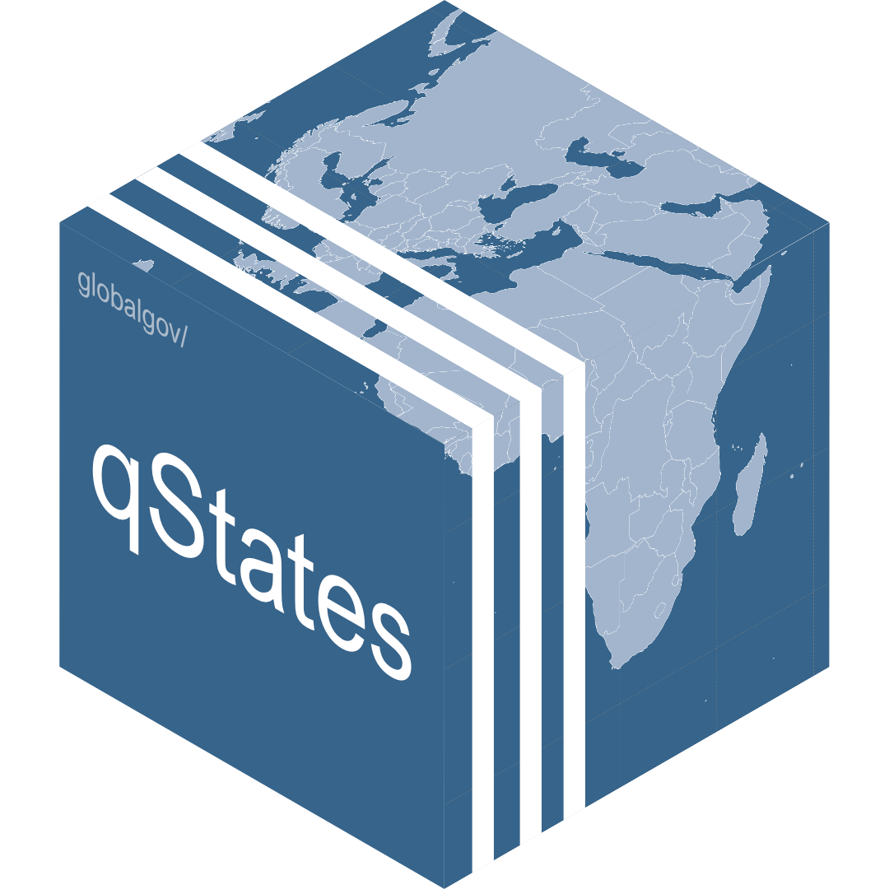

# qStates 

<!-- badges: start -->

[](https://www.tidyverse.org/lifecycle/#experimental)


<!-- badges: end -->

`qStates` is a data package within the [`{qData}`
ecosystem](https://github.com/globalgov) of qPackages. It contains an
ensemble of datasets currently available on states in the world,
including information on states’ beginning and, where applicable, end
dates, regime characteristics, and state leaders. An important aim of
`qStates` is to record and include states as far back in history as
possible. The package is geared towards global governance research, but
can also be used by anyone interested in state actors across time.

Please also check out [`{qData}`](https://github.com/globalgov/qData)
for more information about the other packages and tools to handle data
from the `{qData}` ecosystem.

## How to install

We’ve made it easier than ever to install and start analysing global
governance data in R. Simply install the core package,
[qData](https://github.com/globalgov/qData), as follows, and then you
can discover, install and update various qPackages from the console.

``` r
# install.packages(remotes)
remotes::install_github("globalgov/qData") # this installs our core package, the only one you need to do independently
qData::get_packages() # this prints a list of the publicly available data packages currently available
qData::get_packages("qStates") # this downloads and installs the named package
```

## Data included

Once you have installed `{qData}`, you can see the different databases
and datasets included in the `{qStates}` package using the following
function.

``` r
qData::data_contrast("qStates")
```

Working with ensembles of related data has many advantages for robust
analysis. Just take a look at our vignettes
[here](https://globalgov.github.io/qData/articles/user.html).

## qPackages

The [qData](https://github.com/globalgov/qData) ecosystem is aimed at
collecting, connecting and correcting network data across issue-domains
of global governance.

While some qPackages can and do include novel data, much of what they
offer involves standing on the shoulders of giants. qPackages endeavour
to be as transparent as possible about where data comes from, how it has
been coded and/or relabelled, and who has done the work. As such, we
make it easy to cite the datasets you use by listing the official
references using the function above, as well as the package providers
for their work assembling the data by using the function below.

``` r
citation("qStates")
```

    ## 
    ## To cite qStates in publications use:
    ## 
    ##   J. Hollway. qStates: States for qData. 2021.
    ## 
    ## A BibTeX entry for LaTeX users is
    ## 
    ##   @Manual{,
    ##     title = {qStates: States for qData},
    ##     author = {James Hollway},
    ##     year = {2021},
    ##     url = {https://github.com/globalgov/qStates},
    ##   }

## Contributing

[qData](https://github.com/globalgov/qData/blob/main/.github/CONTRIBUTING.md)
also makes it easy to contribute in lots of different ways.

If you have already developed a dataset salient to this package, please
reach out by flagging this as an
[issue](https://github.com/globalgov/qStates/issues) for us, or by
forking, further developing the package yourself, and opening a [pull
request](https://github.com/globalgov/qStates/pulls) so that your data
can be used easily.

If you have collected or developed other data that may not be best for
this package, but could be useful within the wider ecosystem,
[qData](https://github.com/globalgov/qData) includes a number of
functions that make it easy to create a new qPackage and populate with
clean, consistent global governance data.

If you have any other ideas about how this package or the qData
ecosystem more broadly might better facilitate your empirical analysis,
we’d be very happy to hear from you.
