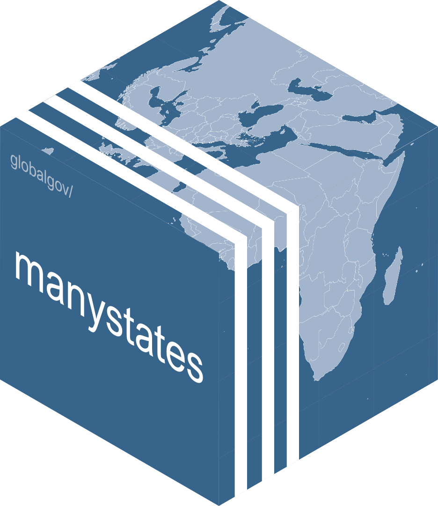

# manystates 

<!-- badges: start -->

[](https://www.tidyverse.org/lifecycle/#stable)


[](https://app.codecov.io/gh/globalgov/manystates?branch=main)
[](https://www.codefactor.io/repository/github/globalgov/manystates)
<!-- badges: end -->

`manystates` is a package within the [many universe of
packages](https://github.com/globalgov) useful for working with states
and state-like entities. It contains an ensemble of datasets on states
and state-like entities in the world, including information on states’
beginning and, where applicable, end dates, and geographical and other
characteristics. Please also check out
[`{manydata}`](https://github.com/globalgov/manydata) for more
information about the other packages and tools to handle data from the
many universe of packages.

In addition, the package includes several unique functions to help you
work with state data, including `code_states()` to identify states
within texts, and `generate_states()` to create fictional state names.
The package is geared towards global governance research, but can also
be used by anyone interested in state actors across time.

## How to install

It is easy to install and start analysing global governance data in R.
Simply install the core package,
[manydata](https://github.com/globalgov/manydata), as follows, and then
you can discover, install and update various ‘many packages’ from the
console.

``` r
# install.packages("manydata") # install the core package
manydata::call_packages() # this prints a list of the publicly available data packages currently available
# manydata::call_packages("manystates") # this downloads and installs the named package
```

## Included data

Once you have installed the package, you can access the primary datacube
in the package, `states`, as follows. You can see that currently the
datacube combines three datasets: Gleditsch and Ward’s (1999) state
list, the International System(s) Dataset (ISD) by Griffiths and Butcher
(2013), and the GGO state list developed by the PANARCHIC team for this
package.

``` r
manydata::describe_datacube(manystates::states)
```

    ## [1] "The `manystates::states` datacube is a list containing 3 datasets: ISD, GW, and GGO"

``` r
manystates::states
```

    ## $ISD
    ## # A tibble: 499 × 36
    ##    stateID StateName       Begin End   StateNameAlt Latitude Longitude StartType
    ##    <chr>   <chr>           <mda> <mda> <chr>        <chr>    <chr>         <dbl>
    ##  1 DEU     Germany         0006… 1945… Prussia      52 31 1… 13 24 18…         3
    ##  2 KOR     Korea           0676… 1905… Koryo, Chos… 37 34 0… 126 58 0…         4
    ##  3 JPN     Japan           0710… 1945… <NA>         35 41 2… 139 41 3…         1
    ##  4 CHI     Chien Khouang,… 0800… 1831… <NA>         19 19 2… 103 21 3…         2
    ##  5 KHM     Cambodia        0802… 1863… Khmer Kingd… 11 34 1… 104 55 1…         1
    ##  6 FRA     France          0843… 1942… <NA>         48 51 2… 2 21 8 E          3
    ##  7 DNK     Denmark         0950… 1940… <NA>         55 40 3… 12 34 6 E         1
    ##  8 GBR     United Kingdom  1066… 2016… <NA>         51 30 2… 0 7 39 W          1
    ##  9 TON     Tonga           1100… 1900… Kingdom Of … 21 8 0 S 175 12 0…         4
    ## 10 OWO     Owo             1150… 1893… <NA>         7 11 0 N 5 35 0 E          1
    ## # ℹ 489 more rows
    ## # ℹ 28 more variables: EndType <dbl>, cowID <chr>, cowNR <dbl>,
    ## #   ISD_Category <dbl>, Region <dbl>, Start_Am <dbl>, EStart_Am <dbl>,
    ## #   Declare <dbl>, DecDate <chr>, Population <chr>, PopDate <dbl>, PopAm <dbl>,
    ## #   PopulationHigh <dbl>, PopulationLow <dbl>, StartType_Am <dbl>,
    ## #   StartSettle <dbl>, End_Am <dbl>, EndType_Am <dbl>, EndSettle <dbl>,
    ## #   Sovereignty_Am <dbl>, EuroDip <dbl>, Borders <dbl>, Borders_Am <dbl>, …
    ## 
    ## $GW
    ## # A tibble: 216 × 7
    ##    stateID StateName       Begin        End          StateNameAlt cowID cowNR
    ##    <chr>   <chr>           <mdate>      <mdate>      <chr>        <chr> <chr>
    ##  1 AFG     Afghanistan     ..1816-01-01 1888-12-30   <NA>         AFG   700  
    ##  2 AUH     Austria-Hungary ..1816-01-01 1918-11-13   <NA>         AUH   300  
    ##  3 BAD     Baden           ..1816-01-01 1871-01-17   <NA>         BAD   267  
    ##  4 BAV     Bavaria         ..1816-01-01 1871-01-17   <NA>         BAV   245  
    ##  5 CHE     Switzerland     ..1816-01-01 2017-12-31.. <NA>         SWZ   225  
    ##  6 CHN     China           ..1816-01-01 2017-12-31.. <NA>         CHN   710  
    ##  7 DEU     Germany         ..1816-01-01 1945-05-07   Prussia      GMY   255  
    ##  8 DNK     Denmark         ..1816-01-01 2017-12-31.. <NA>         DEN   390  
    ##  9 DZA     Algeria         ..1816-01-01 1830-07-05   <NA>         ALG   615  
    ## 10 ESP     Spain           ..1816-01-01 2017-12-31.. <NA>         SPN   230  
    ## # ℹ 206 more rows
    ## 
    ## $GGO
    ## # A tibble: 409 × 13
    ##    stateID StateName  Capital Begin End   Latitude Longitude Region StateNameAlt
    ##    <chr>   <chr>      <chr>   <mda> <mda>    <dbl>     <dbl> <chr>  <chr>       
    ##  1 ITA     Italy      Rome    -075… 9999…     41.9    12.5   Weste… <NA>        
    ##  2 SMR     San Marino San Ma… 0301… 9999…     43.9    12.4   South… <NA>        
    ##  3 BGR     Bulgaria   Sofia   0681… 1018…     42.7    23.3   South… <NA>        
    ##  4 ABK     Abkhazia   Anakop… 0778… 1008…     43.0    41.0   Weste… Kingdom of …
    ##  5 DNK     Denmark    Copenh… 0793… 9999…     55.7    12.6   North… <NA>        
    ##  6 FRA     France     Paris   0843… 9999…     48.9     2.35  Weste… <NA>        
    ##  7 HRV     Croatia    Zagreb  0879… 1102…     45.8    16.0   South… <NA>        
    ##  8 CHM     Chamba     Chamba  0920… 1846…     32.6    76.1   South… <NA>        
    ##  9 GBR     United Ki… London  0927… 9999…     51.5    -0.128 Weste… <NA>        
    ## 10 DRV     Annam      Hue     0939… 1883…     16.5   108.    South… <NA>        
    ## # ℹ 399 more rows
    ## # ℹ 4 more variables: CapitalAlt <chr>, Coder <chr>, Comments <chr>,
    ## #   Source <chr>

Working with ensembles of related data has many advantages for robust
analysis. For more information on how to work with ensembles of data,
please see the [manydata package
website](https://manydata.ch/index.html).

### Dataset citations

While some ‘many packages’ can and do include novel data, much of what
they offer involves standing on the shoulders of giants. ‘many packages’
endeavour to be as transparent as possible about where data comes from,
how it has been coded and/or relabelled, and who has done the work. As
such, we make it easy to cite the datasets you use by listing the
official references using the function above, as well as the package
providers for their work assembling the data by using the function
below.

For the [Gleditsch and Ward (GW)
dataset](http://ksgleditsch.com/statelist.html):

Gleditsch, Kristian S., and Michael D. Ward. 1999. “[A revised list of
independent states since the congress of
Vienna](https://doi.org/10.1080/03050629908434958).” *International
Interactions* 25: 393-413.

For the [International System(s) Dataset
(ISD)](https://www.ryan-griffiths.com/data):

Butcher, Charles R., and Ryan D. Griffiths. 2020. “[States and their
international relations since 1816: introducing version 2 of the
International System(s) Dataset
(ISD)](https://doi.org/10.1080/03050629.2020.1707199)”. *International
Interactions*, 46(2), 291–308.

## Included functions

In addition to the datasets, the package also includes two main
functions that help you work with state data.

### code_states()

`code_states()` is useful for identifying states or state-like entities
within text data. This is a non-trivial task, as state names can vary
widely in their spelling, abbreviation, and context, and there are many
potential ambiguities (e.g., “Korea” could refer to North or South
Korea). The function uses a comprehensive library of contemporary and
historical state names and their variants to identify states in a given
text. It returns a data frame with the identified states and their
corresponding ISO 3166 alpha-3 codes or standardised names.

It can handle both single strings and vectors of strings. By default it
will identify the first state mentioned in each text, but it is possible
to search for multiple states by setting the `max_count` argument to a
value greater than 1.

``` r
manystates::code_states(c("The event took place in the United Kingdom.", 
            "Switzerland and New Zealand agreed that...",
            "One of the oldest princely states is Chamba."),
            max_count = 2)
```

    ## [1] "GBR"       "{CHE,NZL}" "CHM"

The function can currently discern 500 different states or state-like
entities. This is likely to increase in future releases, but is already
2.2 times more than the next best package, `{states}`, for instance.

### generate_states()

Additionally, there is a seemingly whimsical function that generates a
number of random state names. This function is inspired by observed
state names, but is not intended to reflect any actual states. It is
primarily designed for use in class exercises when a number of novel
state names are required. It can also be used to generate fictional
state names for creative writing or games.

``` r
manystates::generate_states(3)
```

It is based on a Markov model of syllable patterns found in real state
names. Your mileage with the results of this function may vary, but it
should get more realistic as we add more state names to the underlying
library, and in the meantime it might even be instructive for classroom
exercises.

Feedback on either of these functions is most welcome.

## Development

### Funding details

Development on this package has been funded by the Swiss National
Science Foundation (SNSF) [Grant Number
188976](https://data.snf.ch/grants/grant/188976): “Power and Networks
and the Rate of Change in Institutional Complexes” (PANARCHIC). If you
find the package useful, please cite the package.

### Contributing

If you have already developed a dataset salient to this package, please
reach out by flagging this as an
[issue](https://github.com/globalgov/manystates/issues) for us, or by
forking, further developing the package yourself, and opening a [pull
request](https://github.com/globalgov/manystates/pulls) so that your
data can be made available at the next opportunity.
